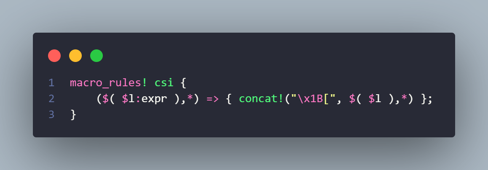

# Introduction

This project represents a simplistic terminal video player. The concept sprang from a simple thought: "If I can convert an image into a matrix of characters, displaying it, then rendering a video shouldn't be a problem".

Due to font constraints and complexity related to color abstraction, the initial step involves parsing the video into its fundamental components: the frames. Each frame undergoes conversion into a grayscale image, resizing it to a fixed size. This process causes some overhead, so, for the sake of speed, we save the intermediary grayscale resized video into a file.

Upon saving the file, we proceed to read it. Each pixel constitutes an unsigned 8-bit integer ranging from 0 to 255. Our task is to map these values from pixel density to characters. While exploring online, I stumbled upon a [blog post detailing how to emulate a gray gradient with characters](https://paulbourke.net/dataformats/asciiart/#:~:text=of%20grey%20is-,%22%20.:-=+*#%25@%22,-An%20obvious%20problem).

The initial attempt yielded promising results but presented a scrolling effect reminiscent of old movies.

Hence, my immediate consideration was to display one frame at a time and clear the screen after each frame for smooth transition. However, this approach resulted in screen flickering.

Delving deeper, I explored crates and stumbled upon crossterm. While analyzing its source code, I noticed a hidden macro called 'csi'.

It's a simple wrapper around the string "\x1B[", but why?
Apparently there exists some special character sequences, called [ANSI escape codes](https://en.wikipedia.org/wiki/ANSI_escape_codeTerminals), whis codes send specific instructions to the terminal about video options.
There was a particular [code](https://gist.github.com/fnky/458719343aabd01cfb17a3a4f7296797#:~:text=ESC%5B%7Bline%7D%3B%7Bcolumn%7Df) that intrigued me.

Sending to the terminal the code "\x1b[0;0f" causes it to return to the initial line and column.

Implementing this adjustment produced a better outcome but transitioned too rapidly. Thus, the final component required was to introduce a delay to mimic a given frames-per-second (FPS). Relying on measurements from this [site](https://fpstoms.com/), I established a ~45 milliseconds timer, resulting in the final rendition.

